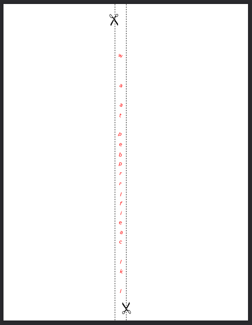

# All Wound Up

### Challenge
> Pencil me in for this challenge!

When you click the clue you are presented with a .pdf file:  
  

The scissor icons and the dotted lines indicate you are supposed to print this out on paper and cut on the dotted lines. The challenge clue is "**pencil** me in". If you wrap the strip of paper around a pencil you can read the message:  

