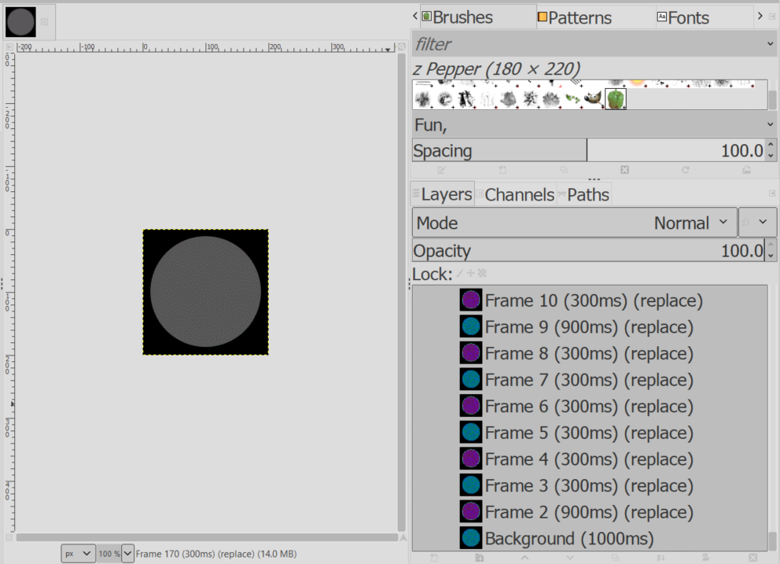

# Blinky

### Challenge
> All you get is a link that brings you to a page that shows you a blinking circle.

  

Obviously this must be a message and you are expected to figure out what kind of encoding it is. Since the flashes appear to be randomly slow and fast, you think this might be Morse code. 

If you are adept at Morse code, you can probably just read it by sight. But for those of us that are not, you need a way to deciper the long and short pulses. One way is to download the .gif image and open it in a program that understands animated gifs. 

Gimp is one application you can use to inspect frames of an animated .gif:  

  

Given this information, you see that the frames alternate between "on" and "off" (or dark/light) and that the duration of the frames are multiples of 300ms. Given the rules of Morse code, you can tediously decode the frames into letters and words:  

