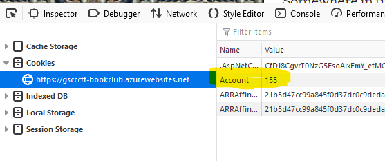
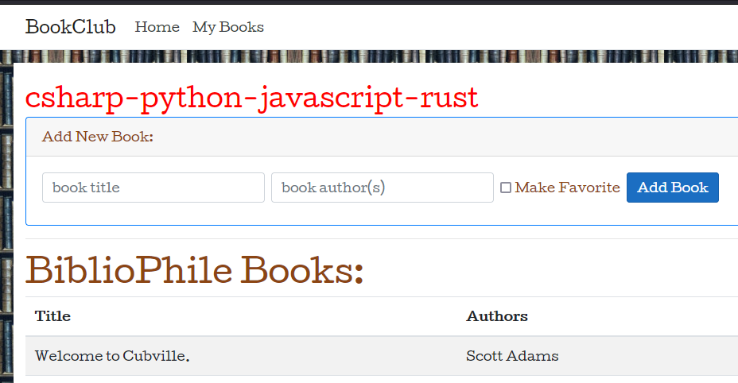

# Book Injection

### Challenge
> Add a book to BiblioPhile's list

There is a link : "goto Book Club"  

If you create an account you can add a book to your own list. This callenge is to add a book to someone else's list. This implies that you have to log in as someone else.  

Like a good hacker, you have been digging into the browser developer tools. A common attack vector is cookies. Looking closer at cookies, you see one named "Account" with a numeric value. Maybe this is the user id?  

  

You start changing the value of the Account cookie and observe that you become logged in as other users. The last part of the challenge is to figure out what account id belongs to user Bibliophile. Your best bet is to brute force every id that is smaller than the one assigned to your own account. With some perseverance you will find BiblioPhile's account. Once you add a book the flag is presented:  

