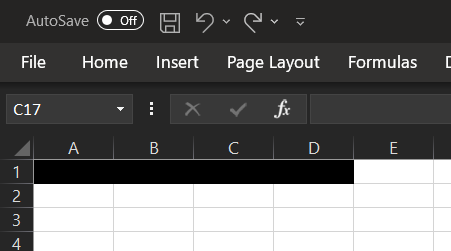
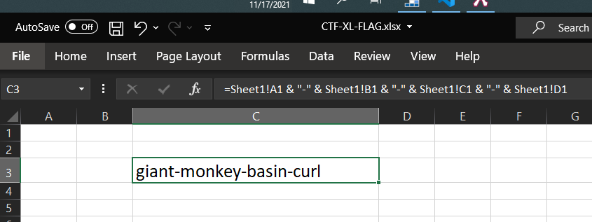

# Excel-lent

### Challenge
> Knowing the password is the only way you'll ever get this one.

When you click the link it will download an Excel file. You open the file and you are presented with a worksheet that has some blacked out cells:  

  

If you try to select the cells you find that you cannot, they are protected. If you try to unprotect the worksheet you are prompted for a password. How will you see what might be hidden in those cells?  

All you need to do is create another worksheet and add a formula to reference Sheet1:  

  

Sheet protection is not about security, it is just about preventing unwanted changes.