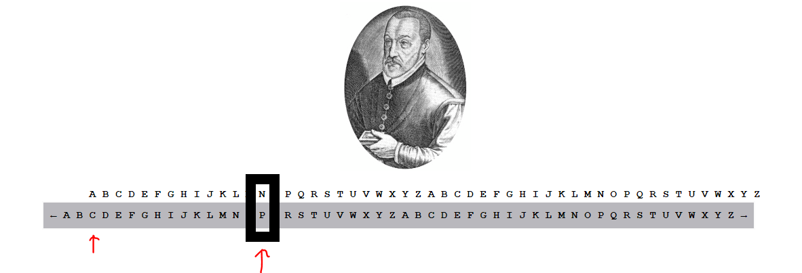

# Let it Slide

### Challenge
> CODECAMP is the key to solving this mess: pcwi-dlgt-ifrypd-fxr

The link provided takes you to this page: https://gsccctf.azurewebsites.net/LetItSlide.html  

This is a variation of a Caesar cipher (See [Friends, Romans, Hackers](../FriendsRomans)) know as the Vigenère Cipher. But instead of each letter using the same offset, each letter has a different offset. The offset is denoted by the key "CODECAMP". For each letter in the key you shift the encoded letter by the same amount. If the key is shorter than the message you simply start over at the start of the key.  

If you drag the gray bar so that "C" is under "A" and look at the letter that appears above "p", you get the decoded value of "N".  

  

 The portrait is of Blaise de Vigenère to whom the cipher was misattributed.  

 Observe:  

|Key | Offset from A | Encoded Letter | Shift by offset to Decode |  
|---|---|---|---|
|C|2|p|N|
|O|14|c|O|
|D|3|w|T|
|E|4|i|E|
||||-|
|C|2|d|B|
|A|0|l|L|
|M|12|g|U|
|P|15|t|E|
||||-|
|C|2|i|G|
|O|14|f|R|
|D|3|r|O|
|E|4|y|U|
|C|2|p|N|
|A|0|d|D|
||||-|
|M|12|f|T|
|P|15|x|I|
|C|2|r|P|
