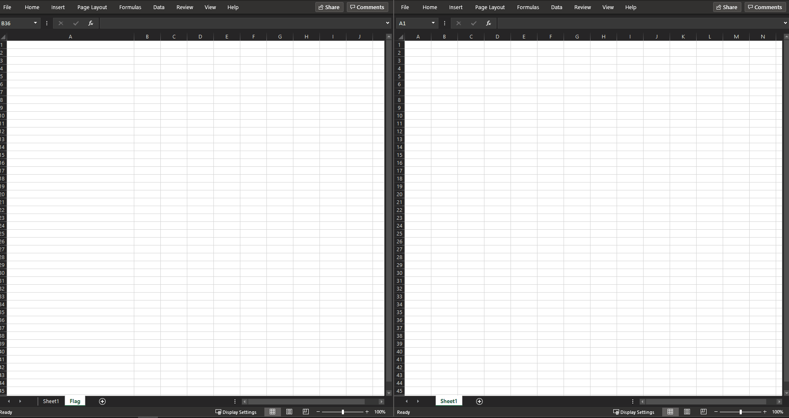

# Macro Level Hack

### Challenge
> I lost the vba project password. Can you help me recover my code?

This challenge is to get at the vba code that will expose which words in Sheet1 of the Excel download make up the flag. Since the vba is password protected, you either have to know the password or find another hack.  

Lucky for you vba security is a joke. All you need to do is open second workbook, drag the "Flag" worksheet from the original workbook to the new one and then open the code editor (Alt+F11). From there you can modify the code to reveal the flag or you can just read the code and go look at the appropriate cells.    

 