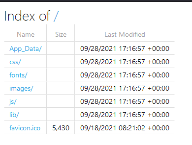
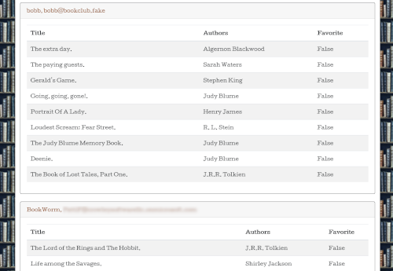

# Phishing with (Book)Worms

### Challenge
> Send a phishing email to Book Club user BookWorm with subject: The best winter reads are here!

This challenge doesn't give you much to go on. As a malicious actor might do, you are expected to poke and prod every corner of the website to see if there is anything interesting exposed. If you click "BookClub" in the menu bar you are presented with an index of folders:

Inspecting the **App_Data** folder, you find a **Logs.txt** file.

Scouring the log file, you might search for "admin" or "password" to determine if something obvious is exposed. You come across this:

`"9/12/2021, 4:40:48.096 PM",a0c8b04ceba47d41,,"GET /BookAdmin","https://gsccctf-bookclub.azurewebsites.net/BookAdmin?password=af%2FIHAVajcdqr+UuyxgZl3x0zYeXNtf%2F",True,200,"88.556","<250ms",request,"{""_MS.ProcessedByMetricExtractors"":""(Name:'Requests', Ver:'1.1')"",""AspNetCoreEnvironment"":""Production""}",,"GET /BookAdmin",40efbec41dd4d849aef91928cd6fab64,40efbec41dd4d849aef91928cd6fab64,,,,,,"1.0.0.0",PC,,,"0.0.0.0",Falmouth,Maine,"United States",,"gsccctf-bookclub",907020b6062c,"4f82099f-fcad-4640-b696-991e6b200017","gscc-ctf","a11e9800-1365-4f46-9818-b42160261957","aspnet5c:2.15.0+2c60e729d6512c31e5791ec93c9f7796d54fe426","2314bf41-13ea-11ec-96a2-df0ce6518aa2",1`

Having found a URL that appears to have an admin role and a password you navigate there and see a list of all users and their passwords:

Now you can send an email to the user, and the system will respond with the flag.

This challenge demonstrates 3 big problems. 
1. BookClub exposes its directory structure
1. It exposes its log files
1. It uses sensitive data in the URL which is logged in plain text.
