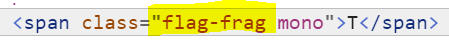
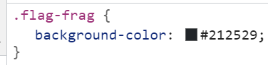
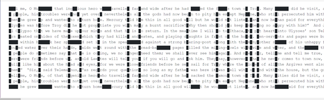

# Background Check

Used browser DevTools in Elements Panel and saw that there was an interesting named class on some span elements

Used the styles area in DevTools and made the existing color darker

And then could see this, scrolled to see entire flag

