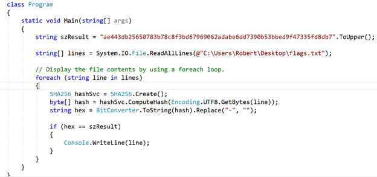

# Choose Wisely

### Challenge
> ae443db25650783b78c8f3bd67969062adabe6dd7390b53bbed9f47335fd8db7
The clue is a link to a long list of what look like flags:

salad-acrid-lower-clasp-exams  
alarm-chemo-chump-cases-bulla  
autos-coeds-retro-clown-burnt  
gases-brews-enter-bluff-solve  
noise-fakir-fatty-hints-study  
siege-cocci-dotes-rival-fleas  
cuter-trail-sheep-patch-bendy  
comes-fizzy-melee-truth-gross  
argot-caked-grave-quilt-field  
etc..  
etc..  

The answer looked like a hex based hash value (I do quite a bit of cryptography work) so I wrote a C# program to take each flag from the file and compute the hash of each and compare to result

