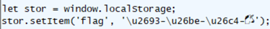
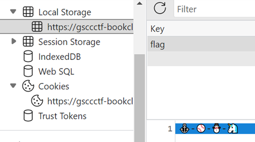

# Clueless

### Challenge

> This is an undocumented flag. Can you find it?

Used Fiddler to trace and noticed a file named /ctf/util.js so looked at it and found this code 

  

Used browser DevTools Application Panel and looked at local storage and saw images that made up flag

  
