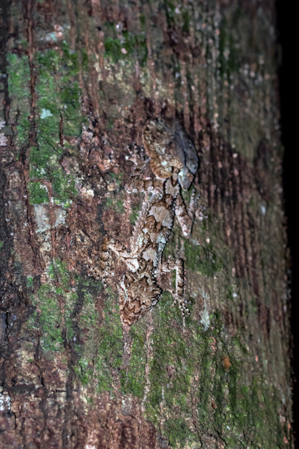
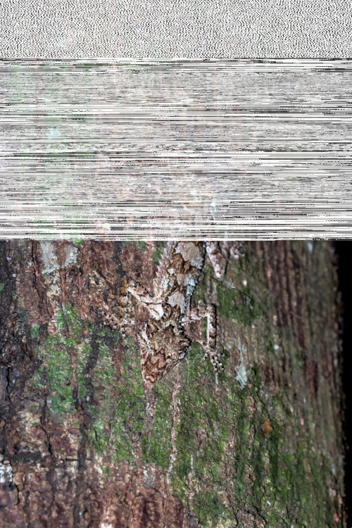
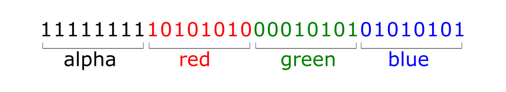

# [The Sound of Color](https://gsccctf.azurewebsites.net/Challenges)

This is a Steganography challenge. [Steganography is the practice of hiding a secret message inside of (or even on top of) something that is not secret.](https://www.comptia.org/blog/what-is-steganography).

You are shown two images that would be identical if it were not for some distortion apparent in the second one:
> Note, these images cannot be used in the solution since .jpg is a lossy format. See the [.NET project](./Code) for a solution you can execute. 

The images themselves are also meant to be a clue. The lizard is hiding itself within the bark of the tree, much like the message is hiding in the bytes of the image file.

 

If you inspect the images pixel-by-pixel in an image editor or by writing some code you would notice that the before and after images differ only in the Alpha component. Let me show you a representation of a pixel in a 32bit image format like .png:

Each pixel is represented by 32 bits. 8 of the bits are the Alpha (or opacity), 8 are the red component, 8 are the green and 8 are blue.

If you read the original image pixel-by-pixel and write the 8 Alpha bits (different from the breakfast cereal) to a new file, then give it a .wav extention, it will be a sound file that speaks the flag. 

### The twist, is that you have to know when to stop reading pixels

The wav file size is much smaller than the image size. That is why the distortion only affects approximately half of the image. Since you don't know how many bytes were in the original .wav file, you must do a little trial and error to determine where to stop reading pixels. At a certain point all the pixels go back to full opacity, so you would look for the end of the .wav file within a few pixels of that transition.

## There is a [complete .NET Core solution](./Code) that shows the encoding and decoding process of this challenge.