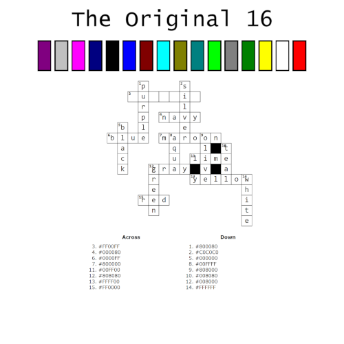

# Sweet 16

### Challenge
> tip: this flag is a single word  

This challenge harkens back to the early days of the web when we had 16 available colors to build our beautiful sites. This crossword puzzle is missing just one of the 16. Of course, the color you have to figure out is a word that actually has two spellings. The spelling that is a color is "fuchsia".  

